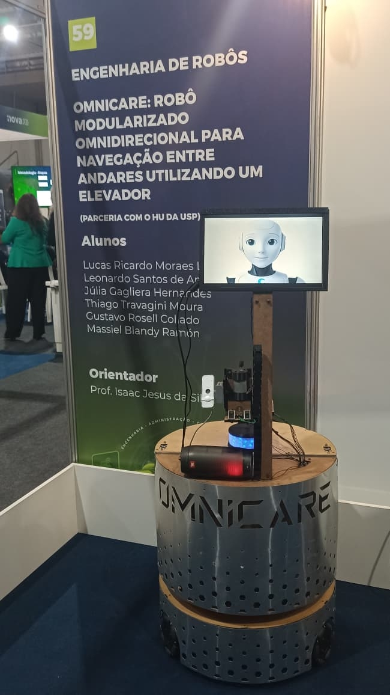

# OmniCare — Robô Móvel Omnidirecional para Navegação Multi-Andares

> Repositório do Trabalho de Conclusão de Curso de Engenharia de Robôs - OmniCare


<p align="center">
  
</p>

---

## 📚 Sumário
- [Visão Geral](#visão-geral)
- [Estrutura do Projeto](#instalação-e-build)
- [Como executar o robô de forma teleoperada](#como-executar-o-robô-de-forma-teleoperada)
- [Como executar o robô para mapear (SLAM ToolBox)](#como-executar-o-robô-para-mapear)
- [Como executar a stack do NAV2](#como-executar-a-stack-do-nav2)

- [Documentações](#documentações)
- [Autores](#👤-autores)
- [Licença](#📝-licença)

---
## Visão Geral

O **OmniCare** é um robô móvel omnidirecional desenvolvido para navegação autônoma em ambientes complexos, com capacidade de deslocamento entre **múltiplos andares** utilizando **elevadores reais**.  
O projeto envolve integração profunda de **ROS 2**, **STM32**, **percepção computacional**, **planejamento de movimento**, **manipulação**, além de uma arquitetura de software robusta baseada em máquina de estados.


## Estrutura do Projeto
 
```bash
.
├── firmware/ # Se concentra todos os firmwares utilizados 
├── hardware/ # Documentação e arquivos da parte eletrônica
├── mechanics/ # Arquivos CAD e modelagem mecânica
├── scripts/
│   ├── record_navigation.sh # Script para gravar a bag de navegação
│   ├── record_vision.sh # Script para gravar a bag de visão
│   ├── scripts.sh # Script para setup do robô
│   ├── setup.sh # Script para setup do robô
│   ├── startup.sh # Script que é rodado quando a jetson "boota"
│   └── sync_omnicare.sh # Script para rsync nootebook --> jetson
│
├── software/src/ # ROS 2 workspace
│   ├── omnicare_bringup/ # Launch principal do OmniCare
│   ├── omnicare_control/ # Controle de movimento do robô
│   ├── omnicare_description/ # Descrição do robô (URDF/XACRO)
│   ├── omnicare_msgs/ # Definição de mensagens customizadas
│   ├── omnicare_navigation/ # Configuração do SLAM e NAV2
│   ├── omnicare_simulation/ # Simulação no Gazebo
│   └── omnicare_vision/ # Módulo de visão computacional
│
└── README.md # Este documento
```

## Instalação e Build

```bash
git clone https://github.com/Thgm01/OmniCare.git
cd OmniCare/software/
rosdep install --from-paths . -y --ignore-src
colcon build --symlink-install
source install/setup.bash
```

## Como executar o robô de forma teleoperada
A teleoperação do OmniCare pode ser feita **diretamente na Jetson** (via SSH) ou **remotamente do seu computador**, desde que ambos utilizem o mesmo **ROS_DOMAIN_ID**.


### **1 - Acesse a Jetson via SSH**
```bash
ssh robot@robot.local
```


### **2 - Inicie o robô (bringup completo)**  
Este comando inicializa os drivers, sensores, TFs e toda a estrutura necessária para operar o robô no mundo real.

```bash
ros2 launch omnicare_bringup load_real_robot.launch.py
```

### **3 - Teleoperação usando teclado**

Você pode rodar o teleop **localmente no seu PC** ou **dentro da Jetson via SSH**.

1. Configure no seu PC o mesmo `ROS_DOMAIN_ID` usado pela Jetson:
```bash
export ROS_DOMAIN_ID=<mesmo_da_jetson>
```

2. Execute o teleop do seu computador:
```bash
ros2 run teleop_twist_keyboard teleop_twist_keyboard
```

## Como executar o robô para mapear
O mapeamento do OmniCare pode ser feita **diretamente na Jetson** (via SSH) ou **remotamente do seu computador**, desde que ambos utilizem o mesmo **ROS_DOMAIN_ID**.


### **1 - Acesse a Jetson via SSH**
```bash
ssh robot@robot.local
```


### **2 - Inicie o robô (bringup completo)**  
Este comando inicializa os drivers, sensores, TFs e toda a estrutura necessária para operar o robô no mundo real.

```bash
ros2 launch omnicare_bringup load_real_robot.launch.py
```

### **3 - Teleoperação usando teclado**

Você pode rodar o teleop **localmente no seu PC** ou **dentro da Jetson via SSH**.

1. Configure no seu PC o mesmo `ROS_DOMAIN_ID` usado pela Jetson:
```bash
export ROS_DOMAIN_ID=<mesmo_da_jetson>
```

2. Execute o teleop do seu computador:
```bash
ros2 run teleop_twist_keyboard teleop_twist_keyboard
```

### **4 - Mapeamento usando o SLAM ToolBox**

Você pode rodar **localmente no seu PC** ou **dentro da Jetson via SSH**.

1. Configure no seu PC o mesmo `ROS_DOMAIN_ID` usado pela Jetson:
```bash
export ROS_DOMAIN_ID=<mesmo_da_jetson>
```

2. Execute o teleop do seu computador:
```bash
ros2 launch navigation_pkg mapping_slam_toolbox.launch.py
```

3. Após rodar o launch do SLAM ToolBox, abra o RViz2 no seu computador com essa configuração
```bash
software/src/omnicare_navigation/navigation_pkg/config/rviz/mapping_cartographer.rviz
```

## Como executar a stack do NAV2
A navegação do OmniCare é preferivel ser feita **em um notebook externo** por conta do processamento, é necessário que ambos utilizem o mesmo **ROS_DOMAIN_ID**.


### **1 - Acesse a Jetson via SSH**
```bash
ssh robot@robot.local
```


### **2 - Inicie o robô (bringup completo)**  
Este comando inicializa os drivers, sensores, TFs e toda a estrutura necessária para operar o robô no mundo real.

```bash
ros2 launch omnicare_bringup load_real_robot.launch.py
```

### **3 - Navegando usando a stack do NAV2**

É recomendado rodar **localmente no seu PC** por conta do processamento pesado de CPU.

1. Configure no seu PC o mesmo `ROS_DOMAIN_ID` usado pela Jetson:
```bash
export ROS_DOMAIN_ID=<mesmo_da_jetson>
```

2. Execute o teleop do seu computador:
```bash
ros2 launch navigation_pkg navigation2.launch.py
```

3. Após rodar o launch do NAV2, abra o RViz2 no seu computador com essa configuração
```bash
software/src/omnicare_navigation/navigation_pkg/config/rviz/navigation.rviz
``` 
## Documentações

A documentação do OmniCare está organizada de forma modular, abrangendo mecânica, hardware, firmware e software.  
Cada módulo possui sua própria pasta dedicada, permitindo uma navegação clara e objetiva.

---

### Documentação Mecânica
A pasta [`mechanics/`](mechanics/) contém:

- Modelos CAD completos do robô  
- Estrutura da base omnidirecional  
- Projeto do manipulador linear  
- Especificações de motores, rodas e sensores mecânicos  

---

### Documentação Hardware
A pasta [`hardware/`](hardware/) contém:

- Esquemáticos elétricos  
- Layout da arquitetura eletrônica  
- Detalhamento dos módulos embarcados  

---

### Documentação Software (ROS 2)

O software do OmniCare é composto por múltiplos pacotes ROS 2, cada um contendo suas características e funcionalidades.

### Pacotes ROS 2
---

### 🔹 [omnicare_behavior](software/src/omnicare_behavior/)
O pacote **omnicare_behavior**, a máquina de estados responsável por coordenar toda a missão do robô. É ele quem controla o fluxo completo da navegação entre diferentes andares, integrando percepção, navegação, manipulação e troca de mapas. O Behavior Manager decide quando iniciar a navegação, alinhar ao elevador, interagir com o painel, trocar de mapa no momento correto e retomar o trajeto até o destino final.

---

### 🔹 [omnicare_bringup](software/src/omnicare_bringup/)
O pacote **omnicare_bringup** é responsável por inicializar todo o sistema do robô, tanto no ambiente real quanto no simulador. Ele carrega automaticamente os módulos essenciais, incluindo o ROS 2 Control, a comunicação com os microcontroladores (STM32), e os sensores embarcados, como o LiDAR. Em resumo, é o pacote que prepara todo o ecossistema do OmniCare para operação, garantindo que hardware, drivers e interfaces estejam corretamente configurados antes da execução dos módulos de navegação e comportamento.

---

### 🔹 [omnicare_control](software/src/omnicare_control/)
O **omnicare_control** é um conjunto de três pacotes que implementa toda a camada de controle de baixo nível do OmniCare. Ele integra a cinemática, a dinâmica e as interfaces de hardware do robô, permitindo que o sistema execute movimentos omnidirecionais de forma precisa e compatível com o ROS 2 Control e o movimento do manipulador.

---

### 🔹 [omnicare_description](software/src/omnicare_description/)

O **omnicare_description** é o pacote responsável por reunir toda a descrição física do OmniCare, incluindo o seu URDF completo, as malhas utilizadas para visualização e os plugins necessários para simulação e controle. Ele define a estrutura mecânica, sensores, atuadores e juntas do robô, garantindo que sua representação virtual seja fiel ao modelo real. Além disso, integra os plugins do Gazebo para simulação física e dos ROS 2 Control para conexão com controladores e interfaces de hardware, servindo como a base unificada para visualização, simulação e operação do robô tanto no ambiente virtual quanto no mundo real.

---

### 🔹 [omnicare_hri](software/src/omnicare_hri/)

O **omnicare_hri** engloba os pacotes dedicados à Interação Humano–Robô (HRI) no OmniCare. Ele é composto por um módulo responsável pelas animações faciais do robô — incluindo expressões exibidas na tela frontal, LEDs de sinalização e o buzzer — permitindo que o robô comunique estados e ações de forma mais amigável ao usuário. Complementando essa funcionalidade, o segundo pacote implementa uma interface para um controle remoto baseado em ESP32, possibilitando acionar comandos do robô de maneira simples.

---

### 🔹 [omnicare_msgs](software/src/omnicare_msgs/)

O **omnicare_msgs** é o pacote responsável por definir todas as mensagens customizadas utilizadas pelos diferentes módulos do OmniCare, incluindo topics, services e actions. Ele centraliza estruturas de dados específicas do projeto — como comandos de movimento, estados do comportamento, mensagens do manipulador, sinais de expressão e eventos da navegação multi-andares — garantindo comunicação padronizada e consistente entre os diversos nós do sistema.

---

### 🔹 [omnicare_navigation](software/src/omnicare_navigation/)
O **omnicare_navigation** reúne um conjunto de pacotes responsáveis por toda a camada de navegação do OmniCare. Ele inclui o pacote do LiDAR, que fornece os dados primários de percepção espacial, e o pacote da IMU, atualmente integrado ao sistema mas ainda não utilizado diretamente na navegação. O núcleo deste módulo é o navigation_pkg, que contém os launch files do NAV2, incluindo configuração de planejadores, BTs e parâmetros de navegação. Além disso, o conjunto oferece launchs específicos para mapeamento do ambiente, permitindo a criação e atualização de mapas utilizados pelo Nav2 e pelo AMCL.

---

### 🔹 [omnicare_simulation](software/src/omnicare_simulation/)
O **omnicare_simulation** reúne todos os recursos necessários para a simulação completa do OmniCare no Gazebo, incluindo launch files dedicados para iniciar o robô, seus sensores e o ambiente virtual. Além disso, o pacote implementa serviços auxiliares de teletransporte dentro do simulador para validação da navegação de multi-andares.

---

### 🔹 [omnicare_vision](software/src/omnicare_vision/)
O **omnicare_vision** concentra todos os pacotes relacionados ao sistema de visão do OmniCare. Ele inclui o usb_cam, que atua como driver da câmera e fornece o fluxo de imagens bruto; o floor_detector, responsável por realizar a inferência sobre o display do elevador e classificar corretamente o andar atual; e o dataset_generator, um pacote auxiliar utilizado para gerar datasets automaticamente a partir de rosbags.


## 👤 Autores

**Lucas Lagoeiro**  
Graduando em Engenharia de Robôs – Centro Universitário FEI  
Área: Programação e Elétrica   
[LinkedIn](https://www.linkedin.com/in/llagoeiro/) • [GitHub](https://github.com/LucasLagoeiro)

**Thiago Moura**  
Graduando em Engenharia de Automação e Controle – Centro Universitário FEI  
Área: Programação e Elétrica  
[LinkedIn](https://www.linkedin.com/in/thiago-t-moura/) • [GitHub](https://github.com/Thgm01)

**Massiel Blandy**  
Graduando em Engenharia de Automação e Controle – Centro Universitário FEI  
Área: Programação  
[LinkedIn](https://www.linkedin.com/in/massiel-blandy-ram%C3%B3n-65214829a/) • [GitHub](https://github.com/massiblandy)

**Júlia Hernandes**  
Graduanda em Engenharia Elétrica – Centro Universitário FEI  
Área: Elétrica  
[LinkedIn](https://www.linkedin.com/in/j%C3%BAlia-gagliera-hernandes-40545b221/) 

**Gustavo Rosell**  
Graduando em Engenharia de Automação e Controle – Centro Universitário FEI  
Área: Mecânica  
[LinkedIn](https://linkedin.com/in/gustavo-rosell) 

**Leonardo Quirino**  
Graduando em Engenharia de Robôs – Centro Universitário FEI  
Área: Mecânica  
[LinkedIn](https://www.linkedin.com/in/leonardo-quirino-353486218/)

## 📝 Licença

Este projeto está licenciado sob a Licença MIT.

Isso significa que você pode usar, copiar, modificar, mesclar, publicar, distribuir, sublicenciar e/ou vender cópias do software, desde que mantenha o aviso de copyright e a permissão de licença incluídos em todas as cópias ou partes substanciais do software.

Para mais detalhes, consulte o arquivo [LICENSE](LICENSE).

## 📝 TODO — Documentação dos Pacotes

A seguir está o checklist de pacotes do OmniCare que terão documentação detalhada seguindo o mesmo padrão adotado no `omnicare_behavior`.

### 📦 Pacotes ROS 2

- [x] **omnicare_behavior** — Behavior Manager (FSM, Action Server, multi-andares)
- [x] **omnicare_bringup** — Inicialização do robô (real e simulação)
- [ ] **omnicare_control**
  - [x] omnidrive_stm32
  - [ ] serial_interface_pkg
- [ ] **omnicare_description** — URDF, meshes e plugins
- [ ] **omnicare_hri**
  - [ ] omnicare_expression
- [ ] **omnicare_msgs** — Mensagens, serviços e actions customizadas
- [ ] **omnicare_navigation** — Nav2, LiDAR, IMU e mapeamento
  - [ ] navigation_pkg
- [ ] **omnicare_simulation** — Gazebo, launches e serviços de teleporte
- [ ] **omnicare_vision**
  - [ ] floor_detector
  - [ ] dataset_generator


