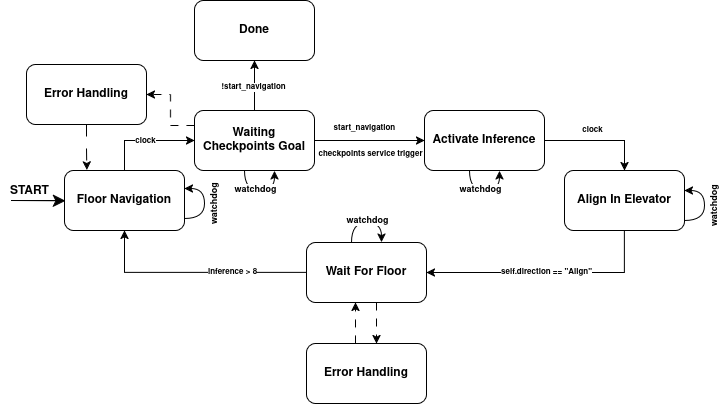

# OmniCare Behavior Manager

O **omnicare_behavior** é o pacote responsável pelo **gerenciamento de comportamento de alto nível** do OmniCare.  
Ele implementa a **máquina de estados (FSM)** que coordena toda a missão do robô, especialmente a **navegação entre andares distintos**, integrando navegação, percepção, manipulação e troca de mapas.

Neste diretório estão reunidos todos os nós, configurações e lógicas relacionadas à tomada de decisão do robô durante a execução de uma missão completa.

---

## Considerações

O Behavior Manager foi projetado com foco em **robustez, previsibilidade e rastreabilidade**.  
Todas as transições de estado são explícitas, monitoradas e condicionadas a eventos bem definidos, como:

- Feedbacks de navegação (Nav2);
- Resultados da percepção (ex.: detecção de andar);
- Confirmações de ações do manipulador;
- Timeouts e watchdogs de segurança.

A implementação segue boas práticas de sistemas robóticos, permitindo fácil depuração e extensão do comportamento.

---

## Arquitetura Geral


O Behavior Manager atua como um **orquestrador de alto nível**, recebendo informações dos subsistemas e decidindo qual ação deve ser executada a seguir.

De forma simplificada, ele:
1. Inicia a missão a partir de um ponto conhecido;
2. Comanda a navegação até o elevador;
3. Realiza o alinhamento e a interação com o painel;
4. Monitora a troca de andar;
5. Solicita a troca de mapa no momento correto;
6. Retoma a navegação até o destino final.


---

<p align="center">
  
</p>

## Máquina de Estados (FSM)

O Behavior Manager é implementado como um **Action Server do ROS 2**, responsável por executar a missão completa de navegação multi-andares.  
A ação recebe quatro parâmetros principais:

- **`world`**: define o ambiente carregado (por exemplo, HU ou FEI);
- **`initial`**: andar inicial, utilizado para determinar o ponto de partida da missão;
- **`target`**: andar alvo que o robô deve alcançar;
- **`simulation`**: flag utilizada para diferenciar execução em simulação ou no robô real.

A partir desses parâmetros, a máquina de estados é iniciada e evolui de forma sequencial, conforme descrito a seguir.

---

### **1. Floor Navigation**

Estado inicial da FSM.  
É responsável por:

- Fazer o parsing do arquivo de configuração ([config/floor_maps_params.yaml](config/floor_maps_params.yaml)) 
- Selecionar e carregar o mapa correspondente ao andar atual;
- Definir a pose inicial do robô naquele mapa;
- Inicializar a sequência de *checkpoints* de navegação definidos para o andar.

Esse estado prepara o sistema para a navegação local antes da interação com o elevador.

---

### **2. Waiting Checkpoints Goal**

Neste estado, o Behavior Manager **monitora a execução dos checkpoints** enviados ao sistema de navegação.  
A transição para o próximo estado ocorre somente quando o último checkpoint do andar atual é atingido, garantindo que o robô chegou corretamente à área do elevador.

---

### **3. Activate Inference**

Estado responsável por **ativar o pipeline de visão computacional** do robô.  
A inferência não permanece ativa durante toda a missão com o objetivo de **reduzir consumo energético** e aumentar a autonomia das baterias do OmniCare.  
A partir deste ponto, o robô passa a analisar o display do elevador.

---

### **4. Align to Elevator Display**

Com a inferência ativa, o robô entra no estado de **alinhamento fino com o display do elevador**.  
Esse alinhamento tem como objetivo compensar erros acumulados da navegação baseada no Nav2, garantindo que o robô esteja posicionado de forma precisa em relação ao elevador e coerente com a pose inicial esperada no próximo mapa.

---

### **5. Waiting for Target Floor**

Após o alinhamento, o Behavior Manager passa a **monitorar continuamente a inferência do display**, aguardando a identificação do andar alvo especificado no parâmetro `target`.  
Este estado permanece ativo até que o robô detecte a chegada ao andar correto.

---

### **6. Target Floor Confirmation**

Quando a visão classifica o andar alvo **oito vezes consecutivas**, o sistema considera, com alta confiabilidade, que o robô chegou ao andar desejado.  
Essa estratégia reduz falsos positivos e garante robustez na detecção do andar.

Confirmada a chegada, a FSM retorna ao estado **Floor Navigation**, agora:

- Carregando o mapa do andar alvo;
- Definindo a nova pose inicial;
- Iniciando os checkpoints correspondentes ao novo andar.

---

### **7. Mission Completion**

Por fim, quando o estado **Waiting Checkpoints Goal** detecta a conclusão dos checkpoints do andar alvo, a máquina de estados é encerrada e a ação é finalizada com sucesso, indicando que a missão de navegação multi-andares foi concluída.

---

## Como executar o Behavior Manager

O **Behavior Manager** é implementado como um **Action Server do ROS 2**.  
Após iniciar o nó, o robô permanece em espera até que uma **requisição de action** seja enviada. A missão de navegação multi-andares **não é iniciada automaticamente**.

---

### Iniciar o Action Server

Primeiramente, execute o nó do Behavior Manager:

```bash
ros2 run omnicare_behavior behavior_manager
```

Após esse comando, o Action Server estará ativo e pronto para receber requisições.

---

### Chamar a Action

Para iniciar a missão, é necessário enviar uma requisição ao Action Server contendo os parâmetros da navegação:

- `world`: ambiente carregado (ex.: `HU` ou `FEI`)
- `initial`: andar inicial
- `target`: andar alvo
- `simulation`: indica se a execução é em simulação ou no robô real
- `presentation`: Go Horse feito para a apresentação de TCC 2 (manter False, caso queira utilizar perguntar para alguém do software da velha guarda - Lagoeiro)

Exemplo de chamada da action via linha de comando:

```bash
ros2 action send_goal   /omnicare/behavior/run_mission   omnicare_msgs/action/RunMission   '{world: presentation, simulation: False, initial: 5, target: 4, presentation: False}'   --feedback
```

Após o envio da action, o Behavior Manager inicia automaticamente a máquina de estados e passa a executar todas as etapas da missão.

---

### Monitoramento da Execução

Durante a execução, o Action Server fornece **feedback contínuo**, permitindo acompanhar:

- O estado atual da máquina de estados  
- O progresso da navegação  
- Eventos de troca de andar  
- A finalização ou falha da missão  

A action é concluída apenas quando toda a missão de navegação multi-andares termina com sucesso ou quando ocorre alguma condição de erro tratável.


## Arquivo de Configuração: `floor_maps_params.yaml`

O arquivo **`floor_maps_params.yaml`** é responsável por centralizar todas as informações relacionadas aos **andares**, **mapas** e **checkpoints de navegação** utilizados pelo Behavior Manager.  
Ele permite configurar o comportamento multi-andares do robô de forma **parametrizável**, sem a necessidade de modificar o código-fonte.

---

### Estrutura Geral do Arquivo

Cada andar é descrito como uma entrada independente no arquivo YAML, contendo informações como:

- Nome ou identificador do andar;
- Caminho para o mapa correspondente;
- Pose inicial do robô naquele mapa;
- Lista ordenada de *checkpoints* de navegação.

De forma simplificada, cada andar define como o robô deve se comportar ao entrar naquele ambiente.

---

### Definição de um Andar

Para cada andar, são definidos:

- **Mapa**: arquivo `.yaml` do mapa utilizado pelo Nav2;
- **Pose inicial**: posição e orientação inicial do robô ao carregar o mapa;
- **Checkpoints**: sequência de metas que o robô deve percorrer naquele andar.

Esses checkpoints são utilizados pelo Behavior Manager para guiar o robô até regiões específicas, como a entrada do elevador ou o destino final.

---

### Adicionando um Novo Andar

Para adicionar um novo andar ao sistema, basta:

1. Criar o mapa do ambiente (via [SLAM](/software/src/omnicare_navigation/navigation_pkg));
2. Salvar o mapa no diretório correspondente;
3. Adicionar uma nova entrada no arquivo `floor_maps_params.yaml`, informando:
   - O caminho do mapa;
   - A pose inicial do robô;
   - A lista de checkpoints desejados.

Após isso, o novo andar passa a ser automaticamente reconhecido pelo Behavior Manager e pode ser utilizado como **andar inicial ou alvo** na chamada da action.

---

### Arquivo Utilizado nos Vídeos de Demonstração (Real e Simulação)

Os exemplos abaixo correspondem ao **arquivo oficial `floor_maps_params.yaml` utilizado nas gravações dos vídeos de demonstração do OmniCare**, tanto no **robô real** quanto em **simulação**, no ambiente da **FEI**.

---

#### Configuração para Robô Real

```yaml
FEI:
  real:
    '5':
      map_path: "config/maps/FEI/FEI_quintoAndar_elevadorManutencao.yaml"
      checkpoints: "quinto_andar_manutencao"
      position:
        x: 3.78
        y: -0.76
      orientation:
        yaw: 0.83
    '4':
      map_path: "config/maps/FEI/FEI_quartoAndar_elevadorManutencao.yaml"
      checkpoints: "quarto_andar_manutencao"
      position:
        x: -5.04
        y: 12.61
      orientation:
        yaw: -1.21
...
```

Essa configuração define os mapas, poses iniciais e checkpoints utilizados pelo robô físico durante a navegação multi-andares, exatamente como demonstrado nos vídeos gravados no ambiente real da FEI.

---

#### Configuração para Simulação

```yaml
...
  sim:
    '5':
      map_path: "config/maps/simulation/simulation_quintoAndar_firstElevator.yaml"
      checkpoints: "simulation_FEI_quintoAndar"
      position:
        x: -3.986
        y: -1.120
      orientation:
        yaw: 0.95
      teleport:
        position:
          x: 3.78
          y: -0.76
          z: 0.120965
        orientation:
          yaw: 0.83
```

Na simulação, além do mapa, pose inicial e checkpoints, é definido o campo **`teleport`**, utilizado para **reposicionar o robô diretamente no ambiente do Gazebo** após a troca de andar.  
Esse mecanismo permite reproduzir o comportamento do elevador no simulador, mantendo coerência com as poses utilizadas no robô real.

---

Com essa separação entre **real** e **simulação**, o Behavior Manager consegue reutilizar a mesma lógica de navegação e troca de mapas, adaptando automaticamente o comportamento conforme o modo de execução.