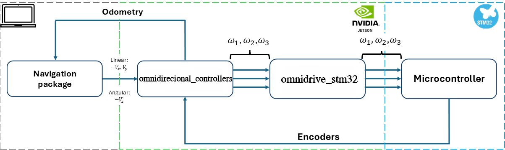

# OmniDrive STM32 (`omnidrive_stm32`)

O **`omnidrive_stm32`** é o pacote responsável por implementar a **Hardware Interface** do **ROS 2 Control** para a base móvel do OmniCare, realizando a ponte entre os controladores de alto nível e o **microcontrolador STM32** que executa o controle de baixo nível dos motores.

Em outras palavras, este pacote “fecha” o conceito do `ros2_control`: enquanto os controladores (ex.: `omnidirectional_controllers`) calculam as velocidades desejadas, o `omnidrive_stm32` é o componente que **envia esses comandos ao STM32** e **lê o feedback** (encoders/estado) para disponibilizar ao restante do sistema.

---

## Considerações

O pacote foi desenvolvido para garantir:

- Integração nativa com o **`omnidirecional_controllers`** do ROS 2 Control;
- Comunicação robusta com o STM32 (ex.: serial/UART/USB, conforme configuração do projeto);
- Publicação de estados para depuração e monitoração;
- Separação clara entre **controle de alto nível (ROS 2)** e **controle de baixo nível (STM32)**.

---

## Diagrama de Fluxo

  

---

## Arquitetura Geral

O `omnidrive_stm32` atua como a camada de interface entre:

- **ROS 2 Control** (controladores e controller_manager)
- **STM32** (firmware da base responsável por PWM, leitura de encoders, PID e proteções)

Fluxo simplificado:

1. O ROS 2 Control recebe um comando de velocidade (ex.: `/cmd_vel`);
2. O controlador converte isso em comandos para as rodas;
3. O `omnidrive_stm32` envia esses comandos ao STM32;
4. O STM32 executa o controle de motores e retorna feedback (encoders/estado);
5. O `omnidrive_stm32` publica os estados para o ROS 2 Control (ex.: `joint_states` / estados internos).

---

## Funcionalidades Principais

- **Envio de comandos** de velocidade/rotação para o STM32;
- **Leitura de feedback** dos encoders (e/ou estados reportados pelo firmware);
- Atualização do **estado das juntas** (wheel joints) para o pipeline do ROS 2 Control;
- Parametrização de porta/baudrate/protocolo (dependendo da implementação);
- Suporte a inicialização via bringup, permitindo subir o robô com um único launch.

---

## Integração com Outros Pacotes

O `omnidrive_stm32` é utilizado diretamente por:

- **`omnidirectional_controllers`**: controladores que geram comandos para as rodas;
- **`omnicare_bringup`**: inicialização do ROS 2 Control e carregamento da interface é feita pelo launch **load_real_robot.launch.py**;
- **`omnicare_description`**: definição das juntas e transmissão no URDF para o ROS 2 Control;
- **Firmware STM32** (em `firmware/`): implementação do lado embarcado que espera receber a velocidade desejada para o controle dos motores e envia o feedback dos encoders.

---

## Papel no Sistema

O `omnidrive_stm32` é o pacote que permite que o OmniCare utilize o **ROS 2 Control de ponta a ponta** no robô real, conectando controladores ROS 2 ao hardware físico da base.  
Sem ele, o sistema não conseguiria aplicar os comandos de movimento no STM32 nem obter feedback confiável de estado das rodas, comprometendo a navegação, odometria e controle do robô.

## Links interessantes relacionados ao ROS 2 Control

1 - Esse canal possui alguns videos relacionados ao ros2 control que possa ajudar, inclusive esse pacote é baseado no dele (por isso que possui umas paradas aleatórias nesse pacote kkkkkkk) > https://youtu.be/J02jEKawE5U
